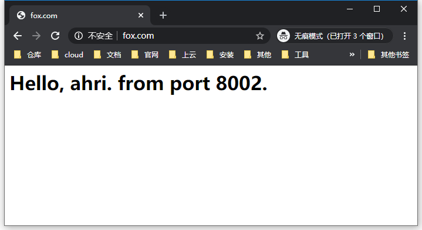

## 本页目录

[[toc]]

## 前置环境

#### 续上一篇文章 [Nginx 反向代理](https://docs.ahriknow.com/nginx/Nginx%E5%8F%8D%E5%90%91%E4%BB%A3%E7%90%86.html)

```sh
[root@localhost ~]# docker container ls -a
CONTAINER ID        IMAGE               COMMAND                  CREATED             STATUS              PORTS                  NAMES
73d0688adbd5        nginx               "nginx -g 'daemon of…"   58 minutes ago      Up 58 minutes       0.0.0.0:8002->80/tcp   n8002
eb5ebab8a5b8        nginx               "nginx -g 'daemon of…"   58 minutes ago      Up 58 minutes       0.0.0.0:8001->80/tcp   n8001
65fe8597a21a        nginx               "nginx -g 'daemon of…"   59 minutes ago      Up 34 minutes       0.0.0.0:80->80/tcp     n80
[root@localhost ~]#
```

## 编辑 Nginx 配置文件

```sh
# 删除反向代理配置文件
[root@localhost ~]# rm /tmp/nginx/n80/conf.d/proxy.conf

# 添加负载均衡配置文件
[root@localhost ~]# vim /tmp/nginx/n80/conf.d/balance.conf

upstream balance {
        server  10.10.10.100:8001;
        server  10.10.10.100:8002;
}

server {
        listen       80;
        server_name  fox.com;

        location / {
            proxy_pass  http://balance;
        }
}

[root@localhost ~]# docker container restart n80
n80
[root@localhost ~]#
```

#### 访问


#### 刷新



## 负载均衡分配策略

1.  轮询(默认)


    每个请求按时间顺序逐一分配到不同的后端服务器，如果后端服务器 down 掉，自动剔除

2.  权重 (weight)


    weight 默认为 1，权重越高，分配的客户端越多

    ```sh
    # 分配到 10.10.10.100:8002 的客户端将是 10.10.10.100:8001 的2倍
    upstream balance {
            server  10.10.10.100:8001   weight=5;
            server  10.10.10.100:8002   weight=10;
    }
    ```

3.  访问 ip (ip_hash)


    每个请求按访问 ip 的 hash 结果分配，每个客户端固定访问一个后台服务器，可以解决 session 问题

    ```sh
    # 分配到 10.10.10.100:8002 的客户端将是 10.10.10.100:8001 的2倍
    upstream balance {
            ip_hash;
            server  10.10.10.100:8001;
            server  10.10.10.100:8002;
    }
    ```

4.  最少连接数 (least_conn)


    将请求分发到负载低的服务器上

    ```sh
    upstream balance {
            least_conn;
            server  10.10.10.100:8001;
            server  10.10.10.100:8002;
    }
    ```

5.  第三方 1 (fair)


    按后端服务器的响应时间来分配请求，响应时间短的优先分配

    ```sh
    upstream balance {
            server  10.10.10.100:8001;
            server  10.10.10.100:8002;
            fair;
    }
    ```

6.  第三方 2 (url_hash)


    按访问 url 的 hash 结果来分配请求，使每个 url 定向到同一个后端服务器，后端服务器为缓存服务器时比较有效

    ```sh
    upstream balance {
            server  10.10.10.100:8001;
            server  10.10.10.100:8002;
            hash $request_uri;
    }
    ```

<Valine />
